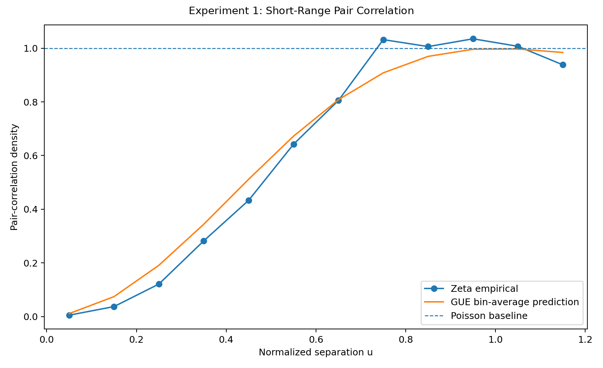
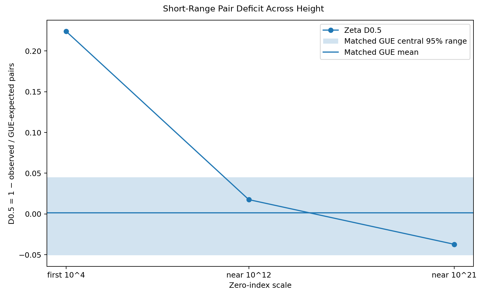
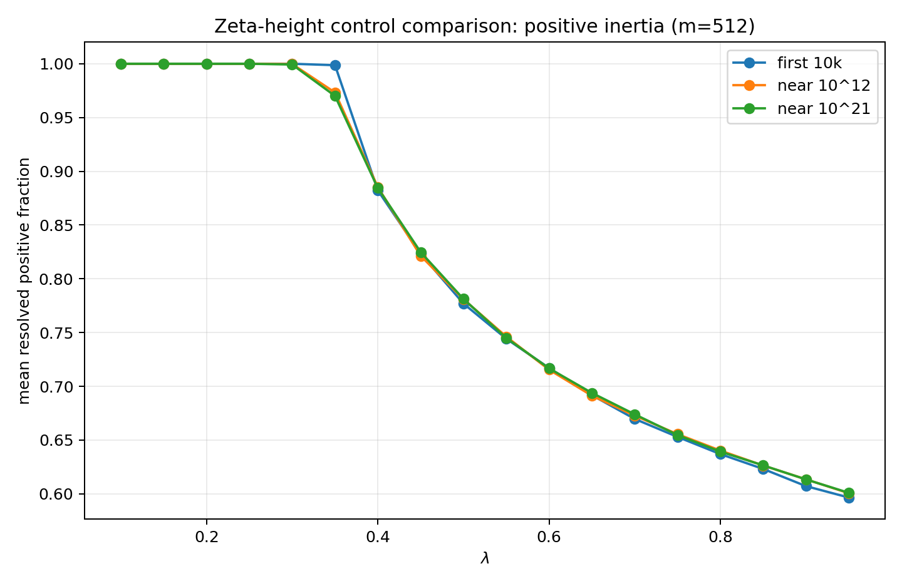
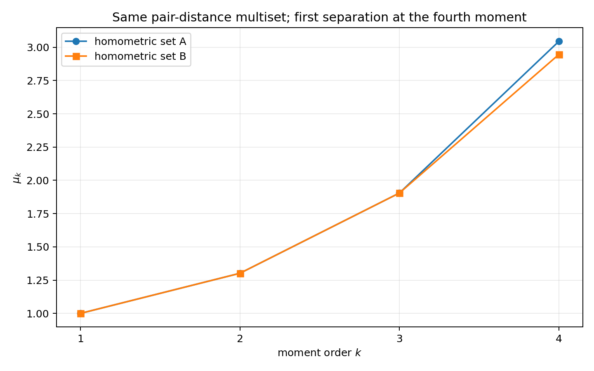
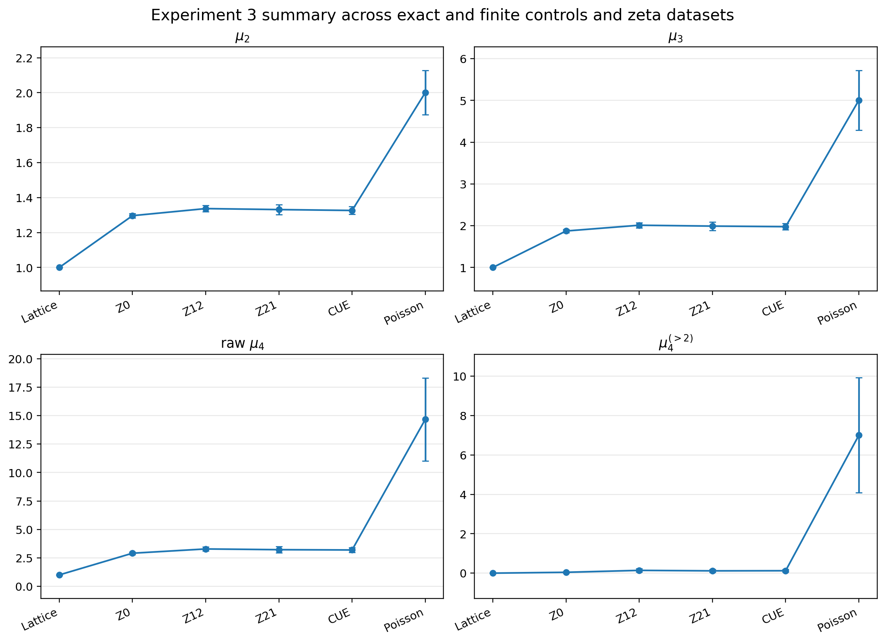
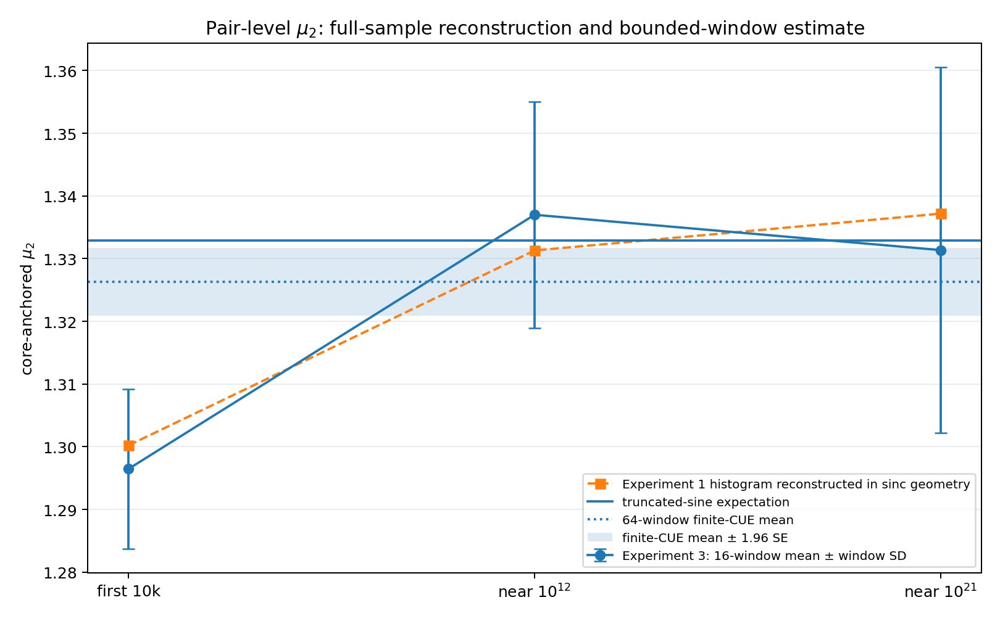
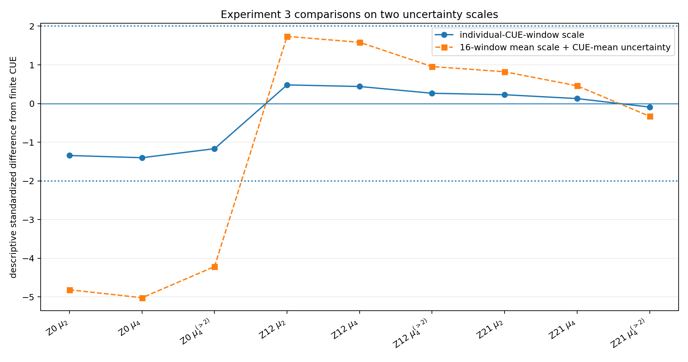
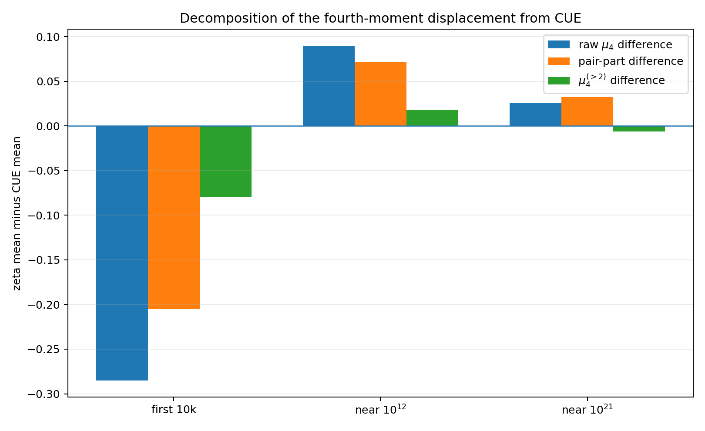

# A Computational Walk from Pair Correlation to Higher-Order Spectral Statistics of Zeta Zeros

## Three reproducible experiments with unfolded zeros and finite kernel matrices

**Serge-Paul Carrasco**  
*Independent researcher*

**Date:** September 12, 2026  
**Version:** Draft 1.8

**MSC 2020 (proposed):** 11M26, 11Y35, 15A18, 15B52, 60G55  
**Suggested arXiv category:** math.NT; possible cross-listing in math.PR or math-ph  
**Keywords:** Riemann zeta function; pair correlation; unfolding; random matrix theory; kernel matrices; Hermitian inertia; spectral moments; sinc kernel; collision decomposition; homometric sets; reproducible computation

---

## Abstract

We study, through three reproducible experiments, how finite kernel-based spectral observables encode structure in unfolded Riemann-zeta zero configurations. The study takes as its point of departure the 2026 results of Alpöge and Furman and of Lamzouri, where Hermitian or Hilbert-space quadratic structures and second-moment estimates yield new unconditional bounds for simple critical-line and distinct zeros. We do not reproduce those proofs. Instead, we investigate the complementary finite question they suggest: what information about a zero configuration is retained by a chosen observable?

Experiment 1 measures pair correlation at three heights and identifies a strong low-height deformation that is not resolved in the two high-height samples. Experiment 2 maps the same configurations to a Gaussian Hermitian family and shows that its principal scalar summaries are data-free or pair-determined. Experiment 3 studies core-anchored sinc moments: an exact homometric control proves that the fourth moment can detect arrangement beyond the pair-distance multiset, while an exact collision decomposition shows that most observed raw fourth-moment displacement from finite CUE remains pair-driven. Together, the experiments connect the recent second-moment results to a controlled computational study of how progressively richer observables retain, suppress, or mix different levels of zero structure.

# 1. Introduction

## 1.1 The Riemann Hypothesis

For \(\Re(s)>1\), the Riemann zeta function is defined by the Dirichlet series

\[
\zeta(s)=\sum_{n=1}^{\infty}\frac{1}{n^s}
\]

and by Euler's product

\[
\zeta(s)=\prod_p\left(1-p^{-s}\right)^{-1},
\]

which makes its connection with the prime numbers explicit. The function extends meromorphically to the complex plane, with a simple pole at \(s=1\). Its completed form

\[
\xi(s)
=
\frac12 s(s-1)\pi^{-s/2}\Gamma\!\left(\frac{s}{2}\right)\zeta(s)
\]

is entire and satisfies the functional equation

\[
\xi(s)=\xi(1-s).
\]

The zeros at the negative even integers are called *trivial*. The remaining, nontrivial zeros lie in the critical strip

\[
0<\Re(s)<1
\]

and are written

\[
\rho=\beta+i\gamma.
\]

The functional equation and complex conjugation imply that nontrivial zeros occur symmetrically with respect to the real axis and the critical line \(\Re(s)=1/2\). The Riemann Hypothesis (RH) asserts that

\[
\beta=\frac12
\]

for every nontrivial zero.

The importance of this statement comes from the explicit formulas linking zeros to primes. Schematically, for the Chebyshev function \(\psi(x)\),

\[
\psi(x)
=
x-
\sum_{\rho}\frac{x^{\rho}}{\rho}
+\text{lower-order terms}.
\]

A zero \(\rho=\beta+i\gamma\) contributes an oscillatory term whose size is governed by \(x^{\beta}\). Thus the real parts \(\beta\) control the possible size of prime-counting errors, while the ordinates \(\gamma\) control their oscillation. The computations in this paper use finite lists of ordinates \(\gamma\); they study the local geometry of those ordinates rather than the full explicit formula. Standard background on the zeta function and its zeros may be found in [Titchmarsh1986].

## 1.2 Progress on critical-line and distinct zeros

Let \(N(T)\) denote the number of nontrivial zeros with \(0<\gamma\le T\), counted with multiplicity. Let \(N_0(T)\) count zeros on the critical line with multiplicity, \(N_0^s(T)\) count simple zeros on the critical line, and \(N_d(T)\) count distinct zeros. Since RH remains open, a central line of research asks how large these quantities can be proved to be relative to \(N(T)\).

Hardy proved in 1914 that infinitely many zeros lie on the critical line [Hardy1914]. Hardy and Littlewood then showed that their number up to height \(T\) is \(\gg T\) [HardyLittlewood1921]. Selberg's mollification method produced the first positive proportion [Selberg1942]. Levinson raised the proportion on the line above one third [Levinson1974], and Conrey raised it above two fifths [Conrey1989]. Bui, Conrey, and Young later exceeded \(41\%\) [BCY2011], while Pratt, Robles, Zaharescu, and Zeindler proved

\[
\liminf_{T\to\infty}\frac{N_0(T)}{N(T)}\ge 0.417293,
\qquad
\liminf_{T\to\infty}\frac{N_0^s(T)}{N(T)}\ge 0.407511
\]

[PRZZ2020]. These results progressively enlarge the subset of zeros whose critical-line location can be proved, while remaining fundamentally weaker than an all-zeros statement.

A second route begins with Montgomery's pair-correlation theorem. Assuming RH, Montgomery used it to show that at least two thirds of the zeros are simple [Montgomery1973]. Montgomery and Taylor subsequently optimized the test window, obtaining the constant

\[
\frac32-\frac{1}{\sqrt2}\cot\!\left(\frac{1}{\sqrt2}\right)
=0.6725007\ldots
\]

(reported in [Montgomery1975]). Baluyot, Goldston, Suriajaya, and Turnage-Butterbaugh later established the unconditional form of Montgomery's pair-correlation theorem that becomes a key input to the 2026 developments [BGSTB2024].

Alpöge and Furman [AlpogeFurman2026] then used a finite compression of Weil's Hermitian form, a rank--trace inequality, and an unconditional second-moment calculation to prove that more than two thirds of the zeros are simple and lie on the critical line and that more than five sixths are distinct. With the Montgomery--Taylor window, the constants become approximately \(0.67250\) and \(0.83625\). Their argument emerged from a broader Claude research session in which two Anthropic large-language-model agents produced the two decisive mathematical steps; the listed authors subsequently verified, condensed, and communicated the proof and take responsibility for it.

Lamzouri [Lamzouri2026] obtained the same principal constants through a different route: a Hilbert-space inequality replaces the finite-dimensional matrix construction and allows a direct application of unconditional pair correlation. His argument also gives two additional unconditional estimates not present in Alpöge--Furman: at least \(88.76\%\) of zeros are simple or lie on the critical line (or both), and the average of the proportions of simple zeros and critical-line zeros is at least \(83.62\%\).

These two 2026 proofs provide the mathematical point of departure for the present paper. They show that conclusions about zeros depend not only on the zeros being considered, but also on the quadratic object used to encode them and on the moments that can be controlled. Their constructions are theorem-level and retain arithmetic information through Weil's explicit formula or unconditional pair-correlation estimates. Our contribution is different: we build simpler finite kernel matrices from observed unfolded ordinates and determine, computationally and algebraically, what information their spectral summaries can and cannot retain.

## 1.3 The computational question

We study a finite analogue of that information problem:

> **Which levels of structure in a zero point process are visible to a given numerical observable?**

We do not reproduce the theorem-level constructions. Instead, we ask what features of unfolded zero configurations survive when those configurations are passed through simpler kernel matrices and spectral summaries.

Our study developed through three experiments:

\[
\boxed{
\text{pairwise measurement}
\longrightarrow
\text{limits of the first Hermitian instrument}
\longrightarrow
\text{a higher-order-capable statistic}
}
\]

Each experiment changed the scientific question of the next.

| Experiment | Principal question | Instrument or observable | Controlling outcome |
|---|---|---|---|
| 1 | What is visible at the pairwise level? | unfolded pair correlation \(\widehat R_2(u)\) | a pronounced low-height deformation that is no longer resolved in two high-height samples |
| 2 | What does the first Hermitian instrument retain from that structure? | Gaussian Gram matrix and inertia of \(I-\lambda C\) | most principal summaries are data-free or two-point-limited; no separable higher-order residual is isolated |
| 3 | Can a statistic with demonstrable access beyond pair distances be made numerically meaningful? | core-anchored sinc moments and an exact fourth-moment decomposition | exact higher-order capacity on a homometric control; a clear low-height displacement; high-height differences small and calibration-sensitive; most raw displacement pair-driven |

The second moment of a translation-invariant kernel matrix is an additive function of pair differences. For the Gaussian family in Experiment 2, the trace, Frobenius moment, and elementary inertia bound contain no information beyond one weighted pair statistic. By contrast, a fourth sinc-kernel moment is not determined by the unordered pair-distance multiset, as an exact finite control proves. Yet raw fourth moments still contain repeated-index and pair contributions, so access to higher-order structure is not the same as attributing an observed difference to it.

> **Key distinction.** The homometric control establishes the *capacity* of the fourth moment to see arrangement beyond pair distances. The zeta comparisons do not yet provide complete *attribution*, because most of the observed raw displacement is pair-driven and no control matched to the complete measured two-point structure was used.

This distinction connects the three experiments. The Gaussian bridge showed that numerical agreement may simply reconstruct the same pair data through a different formula. That diagnosis led Experiment 3 to separate the pair contribution from the collision-reduced part of the fourth moment rather than treating a raw moment difference as automatically higher-order.

## 1.4 Contributions

The paper makes four main contributions.

1. **A reproducible finite-height pair-correlation study.** We quantify the slow approach of low zeta zeros toward sine-kernel statistics with one fixed short-range statistic, an edge-corrected estimator, and matched finite-GUE calibration at three heights.

2. **An exact diagnosis of the first Hermitian instrument.** We reproduce all numerical outputs of a preregistered Gaussian model and determine which of its observables are data-free, pair-determined, or potentially richer.

3. **A validated fourth-moment instrument.** We introduce a boundary-controlled sinc-kernel statistic, prove an exact collision decomposition, and use a homometric pair to demonstrate that its fourth moment contains arrangement information not fixed by the unordered pair-distance multiset.

4. **A bounded cross-height comparison.** We compare the same sinc-moment hierarchy across lattice, CUE, Poisson, and three zeta heights; reconstruct the sinc second moment from the Experiment 1 pair histograms; distinguish individual-window variation from finite-reference uncertainty; and measure how much of each raw fourth-moment difference is pair-driven.

## 1.5 Scope

The Gaussian and sinc matrices use unfolded ordinates only. They do not include the real parts \(\beta\) of zeros or the prime-side terms of the explicit formula. The conclusions therefore concern the stated finite observables and their behavior on the selected point configurations.

The main open question left by the bounded study is:

> **Does the collision-reduced fourth-moment behavior of zeta zeros differ from a well-defined comparison that accounts for their complete measured two-point structure?**

## 1.6 Overview of the paper

Section 2 develops the mathematical framework and the exact formulas used by the three experiments. Section 3 describes the datasets, controls, and reproducibility design. Sections 4--6 present Experiments 1--3. Section 7 synthesizes what the three observables retain, and Section 8 concludes. Appendix A records the reproducibility and data package, while Appendix B outlines future work.

# 2. Mathematical framework: from zero ordinates to spectral observables

All three experiments begin with the same raw objects—the ordinates \(\gamma_n\) of zeta zeros—but apply different transformations to them. The information flow is

\[
\{\gamma_n\}
\xrightarrow{\text{unfolding}}
\{x_n\}
\xrightarrow{\text{pair differences}}
R_2
\xrightarrow{\text{kernel}}
C\ \text{or}\ K
\xrightarrow{\text{spectral summary}}
\operatorname{tr},\ \|\cdot\|_F,\ \text{inertia},\ \mu_k.
\]

Each arrow retains some information and discards some. The purpose of this section is therefore not only to list formulas, but to explain what each formula measures, why it is used, and how it enters the computations in Sections 4–6.

## 2.1 Unfolding and pair correlation: placing different heights on one scale

The density of zeta zeros increases slowly with height, so raw ordinate differences cannot be compared directly between low and high samples. Let

\[
N(T)
=
\sum_{\substack{\rho=\beta+i\gamma\\0<\gamma\le T}}1
\]

count nontrivial zeros with multiplicity. The smooth part of the Riemann--von Mangoldt formula is

\[
\overline N(T)
=
\frac{T}{2\pi}\log\!\left(\frac{T}{2\pi}\right)
-
\frac{T}{2\pi}
+
\frac78.
\]

Its derivative,

\[
\overline N'(T)
=
\frac{1}{2\pi}\log\!\left(\frac{T}{2\pi}\right),
\]

is the first-order local density of zeros near height \(T\). The corresponding average raw spacing is approximately \(1/\overline N'(T)\). Unfolding applies the smooth counting function to each ordinate,

\[
x_n=\overline N(\gamma_n),
\]

so that consecutive \(x_n\) have mean spacing approximately one. A separation \(u=1\) then means roughly one local mean spacing at every height. This common scale is essential: Experiment 1 compares three height regimes, and Experiments 2 and 3 use the unfolded points as matrix inputs.

At the largest ordinates, absolute values are of order \(10^{20}\), while the spacings of interest remain of order one after unfolding. We therefore compute relative coordinates from the Riemann--Siegel theta function at arbitrary precision before converting to floating point. This is a numerical implementation of the same local normalization, designed to avoid catastrophic loss of spacing information.

Once the points have unit mean density, their simplest nontrivial statistic is the two-point density \(R_2(u)\): informally, it measures how frequently two points occur at separation \(u\), relative to an uncorrelated unit-density process. For a unit-rate Poisson process,

\[
R_{\mathrm{Poisson}}(u)=1.
\]

The sine-kernel/GUE prediction is

\[
R_{\mathrm{GUE}}(u)
=
1-
\left(\frac{\sin \pi u}{\pi u}\right)^2.
\]

It vanishes quadratically at \(u=0\), expressing *level repulsion*: very small gaps are suppressed. It approaches one for large \(|u|\), where the short-range interaction becomes negligible. Experiment 1 estimates this function empirically and thereby supplies the pairwise baseline against which the later matrix statistics must be interpreted.

Finite observation introduces a geometric correction. For a stationary process observed on an interval of length \(L\), a positive separation \(u\) can occur only over the overlap length \(L-u\). With the factorial-intensity estimate

\[
\widehat{\rho^2}=
\frac{N(N-1)}{L^2},
\]

the expected number of positive pair differences in a bin \([a_k,b_k]\) is

\[
E_k
=
\widehat{\rho^2}
\int_{a_k}^{b_k}(L-u)R_2(u)\,du.
\]

Experiment 1 uses this formula with \(R_{\mathrm{GUE}}\). Experiment 2 uses the same finite-window geometry after inserting a Gaussian weight. For \(k(u)^2=e^{-u^2}\),

\[
\int_a^b(L-u)e^{-u^2}\,du
=
\frac{L\sqrt\pi}{2}
\bigl(\operatorname{erf}b-\operatorname{erf}a\bigr)
+
\frac12\bigl(e^{-b^2}-e^{-a^2}\bigr).
\]

This relation explains the first bridge between experiments: a pair-correlation histogram can reconstruct any smooth weighted pair functional. It also explains the limitation discovered in Experiment 2—the reconstruction is not an independent source of information, because both sides use the same pair differences.

## 2.2 Gaussian kernel matrices, inertia, and pair-limited summaries

Experiment 2 converts a point configuration into a matrix. Given unfolded points \(X=\{x_1,\ldots,x_m\}\), define

\[
C_{ij}=k(x_i-x_j).
\]

For the Gaussian kernel

\[
k(u)=e^{-u^2/2},
\]

nearby points have entries close to one and distant points have entries close to zero. The Gaussian is positive definite, so \(C\) is positive semidefinite; equivalently, it can be interpreted as a Gram matrix of vectors in a feature space. Thus \(C\) is a controlled way of translating pair geometry into linear algebra.

A positive-semidefinite matrix has no negative eigenvalues, so its inertia is trivial. To create spectral sign changes we study

\[
H_\lambda=I-\lambda C.
\]

If \(\mu_j(C)\) are the eigenvalues of \(C\), then

\[
\eta_j(H_\lambda)=1-\lambda\mu_j(C).
\]

As \(\lambda\) increases, the \(j\)-th eigenvalue crosses zero at \(\lambda=1/\mu_j(C)\). The full inertia curve therefore records how the spectrum of \(C\) is distributed. Experiment 2 computes this curve over a fixed \(\lambda\)-grid and across fixed windows and block sizes.

The question is how much information the simpler scalar summaries retain. Because \(C_{ii}=1\),

\[
\operatorname{tr}C=m.
\]

Define the normalized off-diagonal Gaussian energy

\[
D_C
=
\frac{\|C\|_F^2}{m}-1
=
\frac1m\sum_{i\ne j}e^{-(x_i-x_j)^2}.
\]

This is already a weighted pair statistic: it averages a function of each pair separation and contains no explicit triple or quadruple interaction.

The elementary lower bound used in Experiment 2 follows from the positive eigenvalues of a Hermitian matrix. If \(H\) has positive trace and positive eigenvalues \(\xi_1,\ldots,\xi_{n_{\mathrm{pos}}}\), then

\[
\operatorname{tr}H
\le
\sum_{j=1}^{n_{\mathrm{pos}}}\xi_j,
\]

and Cauchy--Schwarz gives

\[
\left(\sum_{j=1}^{n_{\mathrm{pos}}}\xi_j\right)^2
\le
n_{\mathrm{pos}}\sum_{j=1}^{n_{\mathrm{pos}}}\xi_j^2
\le
n_{\mathrm{pos}}\|H\|_F^2.
\]

Hence

\[
 n_{\mathrm{pos}}(H)
\ge
\frac{\operatorname{tr}(H)^2}{\|H\|_F^2}.
\]

This is a general finite-dimensional inequality, not the specialized rank--trace inequality used by Alpöge and Furman.

**Proposition 2.1 (information content of the principal Gaussian summaries).** For \(H_\lambda=I-\lambda C\),

\[
\operatorname{tr}H_\lambda=m(1-\lambda),
\]

\[
\|H_\lambda\|_F^2
=
m\bigl[(1-2\lambda)+\lambda^2(1+D_C)\bigr],
\]

and, whenever \(\operatorname{tr}H_\lambda>0\), the normalized elementary positive-inertia bound is

\[
 b_{\mathrm{pos}}(\lambda)
=
\frac1m
\frac{\operatorname{tr}(H_\lambda)^2}{\|H_\lambda\|_F^2}
=
\frac{(1-\lambda)^2}
{(1-2\lambda)+\lambda^2(1+D_C)}.
\]

Consequently, the trace is independent of the point configuration, while the Frobenius moment and \(b_{\mathrm{pos}}\) depend on it only through the single weighted pair statistic \(D_C\).

**Proof.** The unit diagonal gives \(\operatorname{tr}C=m\). Expanding
\(\|I-\lambda C\|_F^2=\operatorname{tr}(I-2\lambda C+\lambda^2C^2)\)
gives the second identity. The final formula follows by substituting these identities into the elementary positive-inertia bound. \(\square\)

This proposition explains the central result of Experiment 2 before any numerical table is inspected. Three prominent summaries cannot answer a question about structure beyond pairs: the trace contains no point information, and the Frobenius moment and lower bound contain only \(D_C\). The full spectrum can still be richer, because it depends on all spectral moments. Experiment 2 therefore tests whether the inertia curve reveals a residual not already accompanying the measured pair evolution; it finds no clean separation.

## 2.3 Spectral moments as closed walks

To move beyond one weighted pair average, Experiment 3 studies normalized spectral moments

\[
\mu_k(K)=\frac1n\operatorname{tr}(K^k).
\]

These moments have a useful combinatorial interpretation. Expanding the trace gives

\[
\operatorname{tr}(K^k)
=
\sum_{i_0,\ldots,i_{k-1}}
K_{i_0i_1}K_{i_1i_2}\cdots K_{i_{k-1}i_0},
\]

so \(\mu_k\) averages the weights of closed walks of length \(k\) on the complete weighted graph defined by \(K\).

For \(k=2\), every walk moves from \(i\) to \(j\) and back. Thus

\[
\mu_2
=
\frac1n\sum_{i,j}|K_{ij}|^2
\]

is entirely pairwise. At \(k=3\), products such as

\[
K_{ij}K_{jk}K_{ki}
\]

link triangles of points. At \(k=4\), products such as

\[
K_{ij}K_{jk}K_{k\ell}K_{\ell i}
\]

can link four points. This is the first mathematical reason to expect higher powers to carry information not present in an averaged pair function.

There is an important qualification. The sums also include repeated indices—for example \(i=k\)—so a raw higher moment mixes genuine multi-point configurations with lower-order collision terms. Higher moments are therefore *higher-order-capable*, not automatically pure higher-order statistics. Section 2.5 gives the exact decomposition used to separate these contributions in Experiment 3.

A particular spectral comparison explains why the fourth moment, rather than merely the third, is central here. The sharp Alpöge--Furman extremal configuration corresponds at the spectral level to atoms \(0,1,2\) with weights \(1/6,2/3,1/6\). Its first four moments are

\[
1,
\qquad
\frac43,
\qquad
2,
\qquad
\frac{10}{3}.
\]

The quoted sine-process targets are

\[
1,
\qquad
\frac43,
\qquad
2,
\qquad
\frac{13}{4}.
\]

The sequences agree through order three and first separate at order four:

\[
\frac{10}{3}-\frac{13}{4}=\frac1{12}.
\]

This does not turn a finite fourth moment into a critical-line bound. It provides a precise design motivation: among these two spectral models, the first three moments do not distinguish the target from the extremal obstruction, while the fourth does.

## 2.4 Why the sinc kernel is used, and why moments are core-anchored

Experiment 3 replaces the Gaussian kernel by

\[
K_{ij}
=
\operatorname{sinc}_{\pi}(x_i-x_j)
=
\frac{\sin\pi(x_i-x_j)}{\pi(x_i-x_j)},
\qquad K_{ii}=1.
\]

This choice is not merely another convenient smooth kernel. It is linked both to the sine process and to the flat-window architecture behind the theorem-level constructions. At height \(T\), let

\[
\ell=\log\!\left(\frac{T}{2\pi}\right),
\]

so \(\ell/(2\pi)\) is the first-order local mean density of zero ordinates. With Fourier convention \(\widehat f(\xi)=\int f(u)e^{-iu\xi}\,du\), the flat frequency window

\[
\phi^2=\mathbf 1_{[-\ell/2,\ell/2]}
\]

gives

\[
\frac1\ell\,\widehat{\phi^2}(\Delta)
=
\frac{\sin(\ell\Delta/2)}{\ell\Delta/2}.
\]

Under the local linear unfolding \(x=(\ell/2\pi)\gamma\), this becomes \(\operatorname{sinc}_{\pi}(x_i-x_j)\). The calculation explains why sinc is a natural point-side idealization of a flat frequency window. It is still only an idealization: the matrix omits the prime, pole, archimedean, and finite-dimensional normalization terms in the theorem-level constructions.

The same kernel is intrinsic to the sine process, because

\[
1-K(u)^2=R_{\mathrm{GUE}}(u).
\]

It also has an exact normalization control. For the integer lattice \(x_j=j+\phi\), every nonzero difference is an integer, the off-diagonal entries vanish, and

\[
K=I.
\]

All normalized moments then equal one exactly.

Finite windows create a second issue. A term in \((K^k)_{ii}\) can involve intermediate points outside a short observation window, so a whole-matrix trace is biased near the boundaries. Experiment 3 therefore divides each outer window into a central core \(\mathcal C\) and a surrounding halo. The matrix is built on the full window, but only core diagonal entries are averaged:

\[
\widehat\mu_k
=
\frac1{|\mathcal C|}
\sum_{i\in\mathcal C}(K^k)_{ii},
\qquad k=2,3,4.
\]

The halo supplies neighbors on both sides of each core point, reducing the artificial loss of closed walks at the boundary. In the bounded experiment the outer window contains \(512\) points, the core contains \(128\), and each side contributes a \(192\)-point halo.

## 2.5 Exact collision decomposition of the fourth moment

The raw fourth moment contains several kinds of closed four-step walks. To determine whether a measured difference is pair-driven or can involve richer configurations, we classify those walks by the number of distinct indices they visit.

For a real symmetric matrix \(K\) with unit diagonal and core index set \(\mathcal C\), define

\[
S_{2,\mathcal C}
=
\sum_{i\in\mathcal C}\sum_{j\ne i}K_{ij}^2,
\qquad
S_{4,\mathcal C}
=
\sum_{i\in\mathcal C}\sum_{j\ne i}K_{ij}^4,
\]

\[
T_{3,\mathcal C}
=
\sum_{i\in\mathcal C}
\sum_{\substack{j,k\\|\{i,j,k\}|=3}}
K_{ij}K_{jk}K_{ki},
\]

\[
W_{3,\mathcal C}^{(0)}
=
\sum_{i\in\mathcal C}
\sum_{\substack{j,\ell\\|\{i,j,\ell\}|=3}}
K_{ij}^{2}K_{i\ell}^{2},
\]

\[
W_{3,\mathcal C}^{(1)}
=
\sum_{i\in\mathcal C}
\sum_{\substack{j,k\\|\{i,j,k\}|=3}}
K_{ij}^{2}K_{jk}^{2},
\]

and

\[
Q_{4,\mathcal C}
=
\sum_{i\in\mathcal C}
\sum_{\substack{j,k,\ell\\|\{i,j,k,\ell\}|=4}}
K_{ij}K_{jk}K_{k\ell}K_{\ell i}.
\]

The symbols record the geometry of the walk: \(S_2\) and \(S_4\) involve only a pair of points, \(T_3\) and \(W_3\) involve three distinct points, and \(Q_4\) contains all-distinct four-cycles.

**Proposition 2.2 (anchored fourth-moment collision decomposition).**

\[
\sum_{i\in\mathcal C}(K^4)_{ii}
=
|\mathcal C|
+6S_{2,\mathcal C}
+S_{4,\mathcal C}
+4T_{3,\mathcal C}
+W_{3,\mathcal C}^{(0)}
+W_{3,\mathcal C}^{(1)}
+Q_{4,\mathcal C}.
\]

**Proof.** Expand

\[
(K^4)_{ii}
=
\sum_{j,k,\ell}K_{ij}K_{jk}K_{k\ell}K_{\ell i}
\]

and partition the ordered quadruples \((i,j,k,\ell)\) by the cardinality of \(\{i,j,k,\ell\}\). The one-distinct-index class gives \(|\mathcal C|\). For exactly two distinct indices, six closed walks contribute \(K_{ij}^2\) and the alternating walk contributes \(K_{ij}^4\), giving \(6S_{2,\mathcal C}+S_{4,\mathcal C}\). The exactly-three-distinct classes give \(4T_{3,\mathcal C}+W_{3,\mathcal C}^{(0)}+W_{3,\mathcal C}^{(1)}\), with the coefficient \(4\) counting the four placements of the repeated vertex. The all-distinct class gives \(Q_{4,\mathcal C}\). \(\square\)

We report

\[
\boxed{
\widehat\mu_4^{(>2)}
=
\frac{4T_{3,\mathcal C}
+W_{3,\mathcal C}^{(0)}
+W_{3,\mathcal C}^{(1)}
+Q_{4,\mathcal C}}
{|\mathcal C|}
}
\]

alongside the raw fourth moment. Thus

\[
\boxed{
\widehat\mu_4
=
1
+
\frac{6S_{2,\mathcal C}+S_{4,\mathcal C}}{|\mathcal C|}
+
\widehat\mu_4^{(>2)}.
}
\]

The middle term is a weighted two-point statistic. The last term removes all one- and two-distinct-index collisions and can depend on arrangements of three and four points. It is not a connected four-point cumulant, but it is a more informative attribution statistic than raw \(\widehat\mu_4\). In Section 6, the decomposition is applied to every zeta--CUE difference so that the pair contribution is measured rather than assumed absent. In the released code, all collision classes are checked on deterministic small matrices against direct enumeration.

## 2.6 Homometric configurations as an exact test of higher-order capacity

A statistical difference between zeta and a random ensemble can be difficult to interpret, because it may reflect finite sampling or an imperfect reference distribution. Homometric configurations provide a cleaner first test. Two finite configurations are *homometric* when they have the same unordered multiset of pairwise distances. Consequently, every pair-additive statistic

\[
\sum_{i<j}f(|x_i-x_j|)
\]

has the same value on both configurations. Pair histograms, the Gaussian scalar \(D_C\), and the sinc second moment \(\widehat\mu_2\) therefore cannot separate them.

Experiment 3 uses

\[
A=\frac12\{0,1,2,6,8,11\},
\qquad
B=\frac12\{0,1,6,7,9,11\}.
\]

Their pair-distance multisets are identical. If a fourth spectral moment separates them, it proves—without a stochastic model or asymptotic argument—that the statistic sees arrangement information not fixed by that multiset. This is a test of *capacity*: it establishes what the instrument can detect before the instrument is applied to zeta data. Homometry forces equality of pair-additive quantities such as \(\mu_2\), but it does not force equality of \(\mu_3\); the matching third moments of this particular pair are an additional exact feature.

## 2.7 Reconstructing the sinc second moment from pair correlation

The second sinc moment is still a pair statistic, so it can be predicted directly from \(R_2\). This provides a mathematical link between Experiment 1 and Experiment 3 and a way to distinguish a full-sample pair effect from fluctuations of a finite CUE control ensemble.

For a core interval of length \(c\) inside an outer interval with halo length \(h\) on each side, a positive separation \(u\) is available from a core anchor over length

\[
w(u)=
\begin{cases}
c, & 0\le u\le h,\\
h+c-u, & h<u\le h+c,\\
0, & u>h+c.
\end{cases}
\]

For a unit-density stationary process with two-point density \(R_2\), the expected core-anchored sinc second moment is

\[
\mu_2[R_2]
=
1+\frac{2}{c}
\int_0^{h+c}
w(u)R_2(u)\operatorname{sinc}_{\pi}^2(u)\,du.
\]

Experiment 3 has \(c=128\) and \(h=192\). The empirical reconstruction substitutes the frozen piecewise-constant Experiment 1 histogram for \(R_2\) through \(u=30\) and uses the unit baseline beyond \(30\). Replacing the tail by the exact sine curve changes the result by less than \(10^{-7}\). For the exact sine density,

\[
\mu_2^{\mathrm{sine,trunc}}=1.332928978.
\]

The finite-\(N=512\) CUE pair-density correction changes this value by less than \(10^{-6}\), so it does not explain the observed \(0.0066\) shortfall of the \(64\)-realization CUE mean.

This reconstruction is used later for two purposes. First, it checks that the sign of the weighted pair displacement is compatible with Experiment 1 even when a finite CUE sample fluctuates. Second, it prevents a shift in \(\mu_2\) from being misread as higher-order information: by construction, every \(\mu_2\) difference is explained at the pair level.

## 2.8 Descriptive uncertainty scales for the finite comparisons

Experiment 3 compares deterministic zeta windows with a finite ensemble of random CUE windows. There are two natural scales, and they answer different descriptive questions.

Let \(Y_1,\ldots,Y_{64}\) denote one endpoint measured on the \(64\) independent CUE realizations, and let \(\overline X\) be the corresponding mean over the \(16\) fixed windows of one zeta sample. The individual-window score is

\[
z_{\mathrm{window}}
=
\frac{\overline X-\overline Y}{s(Y)}.
\]

It compares the zeta mean difference with the heterogeneity of one CUE window: how large is the shift relative to the variation seen from window to window?

For a comparison of a nominal \(16\)-window mean with a CUE mean estimated from \(64\) windows, the finite-reference mean scale is

\[
z_{\mathrm{mean}}
=
\frac{\overline X-\overline Y}
{s(Y)\sqrt{1/16+1/64}}.
\]

The factor \(1/64\) includes uncertainty in the finite CUE reference mean instead of treating it as exact. This second scale asks how large the observed difference is relative to the nominal variation of two finite means.

Neither quantity is a confirmatory test. The zeta windows are deterministic and are not asserted to be independent random draws from an underlying distribution. The two scores are therefore reported as complementary descriptions of finite-geometry separation, not as p-values or theorem-level probabilities.

## 2.9 Connection with the 2026 proofs of Alpöge--Furman and Lamzouri

The finite matrices in this paper are inspired by the architecture of the two 2026 proofs, but they are not numerical implementations of either argument. It is therefore useful to state both the connection and the separation explicitly.

Alpöge and Furman compress Weil's Hermitian form to a finite matrix \(\widetilde G\). On the zero side, simple critical-line zeros contribute positive rank-one pieces, while symmetric off-line pairs contribute indefinite blocks. Analytic trace and Hilbert--Schmidt estimates, together with a specialized rank--trace inequality, give

\[
N_0^s(T)
\ge
\bigl(2-R(\psi)-o(1)\bigr)N(T),
\]

and a corresponding distinct-zero bound. The mechanism is that the trace is asymptotic to \(N\), the Hilbert--Schmidt square is asymptotic to \(R(\psi)N\), and the zero-side block structure converts those two quantities into rank information. For the indicator window,

\[
R(\psi_0)=\frac43,
\]

so

\[
2-R(\psi_0)=2-\frac43=\frac23.
\]

The Montgomery--Taylor window gives the optimized \(0.67250\ldots\) constant. The same paper identifies a ceiling below approximately \(0.68183\) for the broader bandwidth-one certificate class it studies.

Lamzouri reaches the same extremal problem without a finite matrix. His Hilbert-space inequality combines trace-like and norm-like information with unconditional pair correlation, and it yields the same principal constants together with the additional estimates described in Section 1. In both approaches, the available moments and the structure of the quadratic object determine what can be proved.

The present experiments ask the finite computational question introduced in Section 1.3, but the objects are different:

\[
H_\lambda=I-\lambda C\ne\widetilde G.
\]

Neither the Gaussian instrument nor the sinc matrix contains the explicit formula, the prime-side arithmetic, or the real parts of zeros. Their spectra therefore have no direct theorem-level interpretation. The Gaussian experiment asks what a transparent pair-based matrix retains; the sinc experiment asks whether a linked fourth-moment statistic can access arrangement beyond pair distances. A favorable finite value cannot validate either proof or circumvent the bandwidth-one ceiling. The connection is conceptual: all three settings force us to identify exactly what information a quadratic or spectral observable contains before drawing conclusions from it.

# 3. Data, controls, and reproducibility design

## 3.1 Zeta datasets

We use three samples of \(10{,}000\) consecutive zero ordinates from Odlyzko's tables [OdlyzkoTables].

| Label | Zero range | Approximate height | Role |
|---|---:|---:|---|
| \(Z_0\) | first \(10{,}000\) zeros | \(14\le\gamma\lesssim9.88\times10^3\) | frozen low-height primary sample |
| \(Z_{12}\) | \(10^{12}+1\) through \(10^{12}+10^4\) | \(\gamma\simeq2.68\times10^{11}\) | high-height replication/control |
| \(Z_{21}\) | \(10^{21}+1\) through \(10^{21}+10^4\) | \(\gamma\simeq1.44\times10^{20}\) | high-height replication/control |

The low-height points were checked against the authoritative raw table; the maximum difference from the frozen sequence was \(2.9122\times10^{-9}\), and the pair counts used below were unchanged. At high height, decimal offsets were retained and unfolded at arbitrary precision before conversion to floating point. Mean-spacing assertions, monotonicity checks, source checksums, and provenance records are archived with the data.

The \(Z_{21}\) table is described by its source as probably accurate to \(10^{-6}\), rather than guaranteed at that precision. We therefore treat it as a secondary replication rather than a theorem-level datum.

## 3.2 Random and exact controls

Different experiments require different finite random-matrix controls.

- **Experiment 1:** a matched GUE calibration built from \(200\) replicates. Each replicate combines ten independent Hermite tridiagonal matrices of dimension \(1200\), retaining \(1000\) unfolded bulk eigenvalues from each.
- **Experiment 3 CUE:** \(64\) independent \(N=512\) CUE spectra generated by the Killip--Nenciu CMV construction [KillipNenciu2004]. Each spectrum is independently rotated, sorted, and scaled to circumference \(512\). The sinc matrix then uses ordinary **linear** differences on the resulting interval, not minimum circular distances. The full \(512\)-point spectrum is the outer window and indices \(192\) through \(319\) form the \(128\)-point core.
- **Experiment 3 Poisson:** \(64\) fixed-count circular Poisson samples constructed from \(512\) uniform angles, with the same rotation, scaling, linear-difference convention, and core/halo geometry as CUE.
- **Exact controls:** an integer lattice and a six-point homometric pair.

GUE and CUE have the same sine-kernel local bulk limit but offer different convenient finite constructions. Every comparison is made within the finite geometry in which its calibration was generated; theoretical limiting constants are shown for orientation, not silently substituted for matched controls.

## 3.3 Frozen designs and reproducibility checks

Experiment 1 freezes its estimator, bin width, and short-range statistic before the high-height replication. Experiment 2 uses a preregistered kernel, block manifest, and \(\lambda\)-grid. Experiment 3 is a bounded study executed once under a pre-result protocol. No parameter was changed after viewing its output, and the reserved confirmation dataset was not accessed.

The computational checks are separated from the original result files. Experiment 2's \(2{,}592\) inertia classifications were reconstructed exactly. For Experiment 3, all package checksums were verified, the collision identity was checked by brute-force enumeration, the homometric example was recomputed at high precision, and a clean rerun reproduced the scientific outputs. The corrected release includes the aggregation code, unit tests, and a separate small-matrix collision validator.

## 3.4 Use of the finite-ensemble scales

The two descriptive comparison scales used in Experiment 3 are defined in Section 2.8. We report both the individual-window scale \(z_{\mathrm{window}}\) and the finite-reference mean scale \(z_{\mathrm{mean}}\). Neither is interpreted as a confirmatory test, because the deterministic zeta windows are not modeled as independent random draws.

## 3.5 Pair-histogram reconstruction used in the cross-height comparison

The sinc second moment can be reconstructed directly from the frozen Experiment 1 pair histograms through the finite core/halo formula of Section 2.7. This supplies a benchmark-independent comparison with the truncated sine expectation and clarifies the small, calibration-sensitive ordering of the two high-height samples.

# 4. Experiment 1: establishing the pairwise baseline

Experiment 1 asks what structure is visible before any matrix is introduced. Its purpose is to characterize the point configurations supplied to the later experiments and to quantify the finite-height departure from the asymptotic sine-kernel picture.

## 4.1 Edge-corrected estimator and short-range statistic

For sorted unfolded points \(x_1<\cdots<x_N\), let

\[
d_{ij}=x_j-x_i,
\qquad j>i.
\]

Positive differences are binned over \(0<u\le30\) with width \(\Delta u=0.1\). If \(L=x_N-x_1\), the translation-edge-corrected estimator is

\[
\widehat R_2(u_k)
=
\frac{C_k}
{\widehat{\rho^2}(L-u_k)\Delta u},
\qquad
\widehat{\rho^2}=\frac{N(N-1)}{L^2},
\]

where \(C_k\) is the number of positive differences in the \(k\)-th bin. The GUE comparison uses the bin-averaged, edge-weighted integral of \(R_{\mathrm{GUE}}\), not only its value at the bin center. A \(100\)-realization Poisson test recovers the unit baseline.

The principal short-range statistic is

\[
D_{0.5}
=
1-
\frac{N_{\mathrm{obs}}(0<u<0.5)}
{N_{\mathrm{GUE}}(0<u<0.5)}.
\]

It measures widening of the correlation hole relative to the asymptotic sine-kernel curve.

## 4.2 Low-height result and finite-GUE calibration

For \(Z_0\),

\[
N_{\mathrm{obs}}=878,
\qquad
N_{\mathrm{GUE}}=1131.46,
\]

and hence

\[
D_{0.5}=0.2240.
\]

Thus the first \(10{,}000\) zeros contain approximately \(22.4\%\) fewer pairs below half a mean spacing than the asymptotic prediction. The discrepancy is mainly a redistribution within the first spacing: a deficit for roughly \(0.1\lesssim u\lesssim0.5\) is followed by a compensating excess near \(u\simeq0.75\). Integrated through \(u=1\), the total pair deficit is only \(1.59\%\).

A second diagnostic records the total correlation-hole mass over the measured interval:

\[
S_{30}
=
\int_0^{30}(\widehat R_2(u)-1)\,du.
\]

For \(Z_0\),

\[
S_{30}=-0.507157,
\]

compared with \(-0.498311\) for the sine-kernel curve integrated over the same finite interval. The total missing mass is close to the limiting value \(-1/2\), even though its distribution at very short range is shifted.

Under the matched ten-block geometry,

\[
D_{0.5}^{Z_0}=0.223872,
\]

while the \(200\) matched GUE replicates have

\[
\operatorname{mean}D_{0.5}^{\mathrm{GUE}}=0.001558,
\qquad
\operatorname{sd}D_{0.5}^{\mathrm{GUE}}=0.024797.
\]

No replicate produced a deficit as large as \(Z_0\). The ratio \(8.97\) is retained only as a descriptive ensemble effect size; it is not converted into a Gaussian tail probability, and the Monte Carlo tail resolution is \(1/(200+1)\).

**Figure 1.** Edge-corrected pair correlation for the first \(10{,}000\) zeros, with the finite-window sine-kernel reference and a short-range view of the widened correlation hole.

## 4.3 Replication at greater height

The identical statistic gives

| dataset | \(D_{0.5}\) | \(S_{30}\) |
|---|---:|---:|
| \(Z_0\) | \(+0.2240\) | \(-0.507157\) |
| \(Z_{12}\) | \(+0.0162\) | \(-0.494109\) |
| \(Z_{21}\) | \(-0.0367\) | \(-0.507531\) |

The matched-block high-height values are \(+0.0176\) and \(-0.0371\). Since two matched-GUE standard deviations correspond to approximately \(0.05\), both high-height values lie inside the study's resolution. The supported statement is therefore not that the finite-height correction becomes exactly zero, but that the large low-height deformation is suppressed below an approximately \(5\%\) \(D_{0.5}\) detection scale.

The result is robust to an alternative smooth unfolding and to restricting the low-height sample to nearly affine tails. For the last \(5000\), \(2500\), and \(1000\) low-height zeros, \(D_{0.5}\) remains \(0.206\), \(0.173\), and \(0.258\), respectively. The effect is not produced by the changing mean density across the full low-height sample.

**Figure 2.** The \(D_{0.5}\) statistic at the three zeta heights, shown against the matched finite-GUE reference scale.

## 4.4 Interpretation

Experiment 1 establishes the controlling two-point baseline:

> **The first zeta zeros are strongly repulsive and qualitatively GUE-like, but their short-range correlation hole is wider than the asymptotic sine-kernel shape. At the two larger heights, that deformation is below the experiment's resolution.**

This is a calibrated reproduction and quantification of finite-height behavior, consistent with the classical numerical picture developed by Odlyzko [Odlyzko1987], not a new theorem. Its role in the three-experiment sequence is foundational: any later claim of structure beyond pair correlation must first account for this measured evolution.

---

# 5. Experiment 2: the information ceiling of the first Hermitian instrument

Experiment 2 asks whether a transparent Hermitian construction can extract information not already visible in Experiment 1. The calculation is numerically successful; its main scientific result is that most of the chosen gauges cannot answer that question.

## 5.1 Frozen construction and numerical validation

For each unfolded block \(X=\{x_1,\ldots,x_m\}\),

\[
C_{ij}=e^{-(x_i-x_j)^2/2},
\qquad
H_\lambda=I-\lambda C.
\]

The frozen design uses

| Element | Choice |
|---|---|
| Zeta inputs | \(Z_0,Z_{12},Z_{21}\) |
| Block sizes | \(m\in\{128,256,512\}\) |
| Locations | \(16\) common nested locations |
| Kernel width | \(\sigma=1\) |
| \(\lambda\)-grid | \(0.10,0.15,\ldots,0.95\) |
| Primary route | one eigendecomposition of \(C\) per block |

This gives \(144\) Gram matrices and \(2{,}592\) block/\(\lambda\) classifications. Since

\[
\eta_j(H_\lambda)=1-\lambda\mu_j(C),
\]

the inertia flow is obtained from exact crossing thresholds \(1/\mu_j(C)\). Selected direct diagonalizations of \(H_\lambda\) provide an independent check.

All \(2{,}592\) classifications were independently reproduced. No sign remained unresolved. The closest frozen-grid eigenvalue to zero was \(2.516\times10^{-6}\), approximately \(1.49\times10^4\) screening thresholds from zero. The numerical implementation is therefore not the source of the experiment's limitation.

## 5.2 What the principal observables contain

Proposition 2.1 gives the controlling diagnosis:

| Observable | Information from the points |
|---|---|
| \(\operatorname{tr}H_\lambda\) | none |
| \(\|H_\lambda\|_F^2\) | one Gaussian-weighted pair scalar \(D_C\) |
| \(b_{\mathrm{pos}}(\lambda)\) | the same scalar \(D_C\) |
| full spectrum / \(p_{\mathrm{pos}}(\lambda)\) | potentially richer |

The direct Gaussian pair scalar is

\[
D_C
=
\frac1m\sum_{i\ne j}e^{-(x_i-x_j)^2}.
\]

It can be reconstructed from the Experiment 1 histogram by replacing individual weights with edge-corrected bin averages. For the complete \(Z_0\) sample,

\[
D_C^{\mathrm{direct}}=0.920166507,
\qquad
D_C^{\mathrm{hist}}=0.920974609,
\]

with a relative discrepancy of \(0.042085\%\) in \(\|C\|_F^2\) (equivalently in \(1+D_C\)); relative to \(D_C\) alone, the discrepancy is \(0.087821\%\). This agreement is not independent zeta evidence. Rebinning gives the expected resolution dependence:

| \(\Delta u\) | Relative discrepancy |
|---:|---:|
| \(0.40\) | \(1.001829\%\) |
| \(0.20\) | \(0.254882\%\) |
| \(0.10\) | \(0.042085\%\) |
| \(0.05\) | \(0.014347\%\) |

A smooth Poisson control also produces a very small discrepancy, while a lattice does not because its pair measure is discrete. The bridge validates normalization, bin integration, and consistency of two code paths; it does not supply a second statistical observation.

## 5.3 Inertia and finite-instrument sensitivity

For the primary \(m=512\) low-height blocks:

| \(\lambda\) | \(p_{\mathrm{pos}}\) | \(p_{\mathrm{neg}}\) | \(b_{\mathrm{pos}}\) |
|---:|---:|---:|---:|
| \(0.35\) | \(0.998657\) | \(0.001343\) | \(0.789749\) |
| \(0.50\) | \(0.776978\) | \(0.223022\) | \(0.521322\) |
| \(0.70\) | \(0.669678\) | \(0.330322\) | \(0.166693\) |
| \(0.95\) | \(0.596558\) | \(0.403442\) | \(0.003008\) |

The inertia profile is nontrivial and reproducible. The lower bound becomes extremely loose near \(\lambda=1\), as its closed form already predicts.

Across height, the Gaussian pair scalar moves toward the sine-kernel benchmark:

| Sample | \(D_C\) | Difference from benchmark \(0.952040560\) |
|---|---:|---:|
| \(Z_0\) | \(0.920166507\) | \(-0.031874053\) |
| \(Z_{12}\) | \(0.945813929\) | \(-0.006226631\) |
| \(Z_{21}\) | \(0.951435314\) | \(-0.000605246\) |

This is the Gaussian smoothing of the pair-correlation evolution already measured in Experiment 1. The inertia curves also move closer: for \(m=512\) and \(\lambda\ge0.40\), the largest difference between the \(Z_0\) and \(Z_{21}\) mean positive fractions is \(0.00623\). The Level-1 pair difference and Level-2 inertia difference appear and disappear together; no residual beyond that evolution is isolated.

Finite-instrument effects are of the same scale as some small comparisons. At \(\lambda=0.40\), the largest mean difference between nested \(m=128\) and \(m=512\) blocks is \(0.007202\), with a largest single-location difference of \(0.023438\). Changing the Gaussian width also changes the inertia curve materially. These values are properties of the specified finite apparatus, not universal zeta statistics.

**Figure 3.** Mean positive-inertia profiles for the three zeta heights under the frozen \(m=512\), \(\sigma=1\) Gaussian instrument. Block-size and kernel-width sensitivity are reported numerically in the text and repository rather than encoded in this panel.

## 5.4 Consequences for interpretation

The same computation supports some conclusions and rules out others.

| Quantity or comparison | Supported interpretation |
|---|---|
| histogram reconstruction of \(D_C\) | a finite-bin quadrature and code-path check |
| height evolution of \(D_C\) | a Gaussian-weighted summary of the pair evolution already measured in Experiment 1 |
| collapse of \(b_{\mathrm{pos}}\) near \(\lambda=1\) | an algebraic consequence of its closed form |
| \(b_{\mathrm{pos}}\) across processes | a lower bound and implementation check, not a discriminator beyond \(D_C\) |
| full inertia profile | potentially richer, but no residual beyond the measured pair evolution was isolated |
| number variance of a selected on-line subset | strongly confounded by missing points and thinning |

For independent thinning with retention probability \(p\), rescaled to unit density,

\[
\Sigma^2_{\mathrm{thin}}(L)
=
p^2\Sigma^2_{\mathrm{orig}}(L/p)
+
(1-p)L.
\]

The linear term explains why missing points can imitate a long-range loss of rigidity. Experiment 2 is therefore best understood as a valid finite computation that identifies the limits of its principal observables.

## 5.5 Interpretation and transition

The controlling conclusion is:

> **The first Hermitian instrument is computationally valid, but most of its chosen summary observables are structurally underpowered for isolating information beyond pair correlation.**

The natural successor is an observable whose information content matches the question. Experiment 3 therefore requires three things:

1. demonstrate access beyond the pair-distance multiset on an exact control;
2. control finite-window boundary effects;
3. separate lower-order collision terms from the raw higher moment.

The sinc-kernel fourth moment and the decomposition of Section 2 satisfy these requirements at the level tested next.

# 6. Experiment 3: a bounded sinc-kernel moment study

Experiment 3 asks whether a statistic with verified access beyond pair distances can be applied meaningfully to the same zeta data. It is intentionally bounded. The design was fixed before the output was examined, run once, independently replicated, and not expanded after the result.

## 6.1 Fixed design

Each zeta dataset is sampled at \(16\) deterministic windows of \(512\) consecutive unfolded points. The central \(128\) points form the measured core and the remaining \(192\) points on each side form the halo. The same point count, core indices, linear-difference convention, and moment code are used for every stochastic control.

| Element | Frozen choice |
|---|---|
| Zeta inputs | \(Z_0,Z_{12},Z_{21}\) |
| Windows | \(16\) per zeta dataset |
| Outer window | \(512\) points |
| Core / halo | \(128\) core; \(192\) per side |
| Kernel | normalized sinc |
| Observables | \(\widehat\mu_2,\widehat\mu_3,\widehat\mu_4,\widehat\mu_4^{(>2)}\) |
| Random controls | \(64\) CUE spectra of dimension \(512\); \(64\) fixed-count circular Poisson samples of size \(512\) |
| Difference convention | seeded rotation and scaling to circumference \(512\), followed by ordinary linear differences |
| Exact controls | integer lattice; six-point homometric pair |
| Confirmation data | not accessed |

The study produces \(48\) zeta endpoint rows and \(128\) random-control rows. The collision identity is checked independently on small matrices by direct index enumeration, rather than by reconstructing a residual from its own definition.

## 6.2 Exact capability test: a homometric pair

Consider

\[
A=\tfrac12\{0,1,2,6,8,11\},
\qquad
B=\tfrac12\{0,1,6,7,9,11\}.
\]

The two configurations have the same unordered pair-distance multiset. Their normalized sinc moments are

| Moment | \(A\) | \(B\) |
|---|---:|---:|
| \(\mu_1\) | \(1.0000000000\) | \(1.0000000000\) |
| \(\mu_2\) | \(1.3015493260\) | \(1.3015493260\) |
| \(\mu_3\) | \(1.9046479780\) | \(1.9046479780\) |
| \(\mu_4\) | \(3.0446207814\) | \(2.9463110767\) |

Hence

\[
\boxed{
\mu_4(A)-\mu_4(B)
=
0.098309704778754\ldots
}
\]

while the first three moments agree to the displayed precision. Homometry forces the equality of additive pair functionals such as \(\mu_2\); it does **not** force equality of the triangle statistic \(\mu_3\). The \(\mu_3\) agreement is a special property of this particular pair. An independent high-precision computation reproduces the fourth-moment difference.

This is the cleanest exact result in the study. It proves that the fourth sinc moment can distinguish arrangements on which every additive function of the pair-distance multiset agrees. It establishes **capacity**, not a zeta discovery: a statistic may be able to see higher-order arrangement without the zeta data exhibiting an independently attributable residual.

**Figure 4.** The homometric pair has identical pair-distance multisets and matching first three normalized sinc moments, while the fourth moments differ by \(0.0983097048\).

## 6.3 Exact normalization, dynamic range, and the finite-CUE reference

For the integer lattice,

\[
K=I,
\]

and therefore

\[
\mu_2=\mu_3=\mu_4=1,
\qquad
\mu_4^{(>2)}=0.
\]

The finite random controls give

| Process | \(\mu_2\) | \(\mu_3\) | raw \(\mu_4\) | \(\mu_4^{(>2)}\) |
|---|---:|---:|---:|---:|
| CUE mean | \(1.32631\) | \(1.97725\) | \(3.19307\) | \(0.12261\) |
| Poisson mean | \(2.00081\) | \(5.00389\) | \(14.67303\) | \(6.99848\) |

Lattice, CUE, and Poisson are widely separated, so the instrument has substantial dynamic range. The finite-CUE mean is nevertheless lower than the analytic sine expectation at the \(\mu_2\) level. For the paper's \(512\)-point outer window and \(128\)-point core, the truncated-sine expectation is

\[
\mu_2^{\mathrm{sine,trunc}}=1.332928978,
\]

only \(0.000404\) below \(4/3\). The finite-\(N=512\) CUE correction changes this by less than \(10^{-6}\), whereas the observed \(64\)-realization CUE mean is

\[
1.326307870,
\]

or \(0.006621\) lower—approximately \(2.39\) standard errors of the observed CUE mean. Thus ordinary window truncation does not explain most of the shortfall. It may be a finite-ensemble fluctuation or a remaining finite-construction effect; the bounded study does not distinguish those possibilities. We therefore retain the finite CUE ensemble as the matched descriptive control but do not use its small offset to support a separate high-height zeta claim.

## 6.4 Zeta moment profiles across height

The core-anchored means and individual-window standard deviations are

| Dataset | \(\mu_2\) | \(\mu_3\) | raw \(\mu_4\) | \(\mu_4^{(>2)}\) |
|---|---:|---:|---:|---:|
| \(Z_0\) | \(1.29647\pm0.01275\) | \(1.87369\pm0.04318\) | \(2.90815\pm0.11224\) | \(0.04284\pm0.03658\) |
| \(Z_{12}\) | \(1.33700\pm0.01803\) | \(2.01188\pm0.06115\) | \(3.28254\pm0.17549\) | \(0.14073\pm0.08554\) |
| \(Z_{21}\) | \(1.33136\pm0.02919\) | \(1.99089\pm0.10169\) | \(3.21907\pm0.27180\) | \(0.11634\pm0.07782\) |
| finite CUE | \(1.32631\pm0.02220\) | \(1.97725\pm0.07615\) | \(3.19307\pm0.20339\) | \(0.12261\pm0.06832\) |

The corrected finite-reference mean scale of Section 3.4 gives

| Dataset | \(z_{\mathrm{mean}}(\mu_2)\) | \(z_{\mathrm{mean}}(\mu_3)\) | \(z_{\mathrm{mean}}(\mu_4)\) | \(z_{\mathrm{mean}}(\mu_4^{(>2)})\) |
|---|---:|---:|---:|---:|
| \(Z_0\) | \(-4.82\) | \(-4.91\) | \(-5.02\) | \(-4.22\) |
| \(Z_{12}\) | \(+1.74\) | \(+1.63\) | \(+1.58\) | \(+0.96\) |
| \(Z_{21}\) | \(+0.82\) | \(+0.65\) | \(+0.46\) | \(-0.33\) |

The low-height displacement is robust on both the individual-window and finite-reference mean scales. The high-height differences are much smaller. In particular, once the uncertainty of the finite CUE mean is included, no displayed \(Z_{12}\) moment reaches two descriptive standard units.

The compact summary in Figure 5 places the exact lattice normalization, the three zeta datasets, and the finite CUE and Poisson controls on the same scales for all four displayed moments. It makes the main bounded-study pattern easy to see at a glance: \(Z_0\) sits below the CUE reference across the full moment hierarchy, \(Z_{12}\) and \(Z_{21}\) lie close to finite CUE, and Poisson remains a distant extreme.

**Figure 5.** Compact summary of Experiment 3 across lattice, zeta, finite-CUE, and Poisson datasets for \(\mu_2\), \(\mu_3\), raw \(\mu_4\), and \(\mu_4^{(>2)}\). Error bars show the empirical standard deviation across matched windows; the lattice values are exact.

The independent pair-histogram reconstruction of \(\mu_2\) sharpens the relation to Experiment 1:

| Dataset | Full-sample histogram reconstruction | Difference from truncated sine | Direct Experiment 3 mean over 16 cores |
|---|---:|---:|---:|
| \(Z_0\) | \(1.300215350\) | \(-0.032713628\) | \(1.296465689\) |
| \(Z_{12}\) | \(1.331301111\) | \(-0.001627867\) | \(1.337000198\) |
| \(Z_{21}\) | \(1.337180590\) | \(+0.004251612\) | \(1.331364040\) |
| truncated sine | \(1.332928978\) | \(0\) | — |
| observed finite CUE mean | — | \(-0.006621108\) | \(1.326307870\) |

This reconstruction resolves the apparent sign conflict between Experiments 1 and 3. On the full-sample pair histogram, \(Z_{12}\) remains slightly below the sine expectation, consistent with its small positive \(D_{0.5}\), while \(Z_{21}\) lies slightly above. The direct \(16\)-core means reverse the ordering of the two high-height samples. The reversal is therefore attributable to finite window selection and the unexpectedly low finite-CUE reference, not to a robust change in the underlying pair-level conclusion.

The calibration scales also differ: Experiment 1 compares a full \(10{,}000\)-point statistic with \(200\) full-sample matched replicates, whereas Experiment 3 compares a mean over \(16\) cores (\(2{,}048\) measured core points) with \(64\) finite CUE windows. We therefore retain only the stable conclusion:

> **The first zeros are clearly displaced from the sine/CUE benchmark. Both high-height samples are close to it at the resolution of the bounded study; their small relative ordering is calibration- and sampling-sensitive and is not promoted to a separate empirical effect.**

**Figure 6.** Direct Experiment 3 core means, full-sample reconstructions from the Experiment 1 pair histograms, the truncated-sine expectation, and the finite-CUE reference.

**Figure 7.** Zeta/CUE differences on the individual-window scale and the finite-reference mean scale. The second incorporates the sampling uncertainty of the \(64\)-window CUE reference.

## 6.5 How much of the fourth-moment displacement is pair-driven?

The exact decomposition

\[
\widehat\mu_4
=
1
+
\frac{6S_{2,\mathcal C}+S_{4,\mathcal C}}{|\mathcal C|}
+
\widehat\mu_4^{(>2)}
\]

splits each difference from CUE into a pair component and a collision-reduced component:

| Dataset | Raw \(\Delta\mu_4\) | Pair-part difference | \(>2\)-distinct difference |
|---|---:|---:|---:|
| \(Z_0\) | \(-0.28492\) | \(-0.20514\) | \(-0.07977\) |
| \(Z_{12}\) | \(+0.08947\) | \(+0.07135\) | \(+0.01812\) |
| \(Z_{21}\) | \(+0.02601\) | \(+0.03227\) | \(-0.00627\) |

For \(Z_0\) and \(Z_{12}\), approximately \(72\%\) and \(80\%\) of the raw displacement is carried by pair terms. Near \(10^{21}\), the pair and collision-reduced components have opposite signs and mostly cancel.

This decomposition is the main restraint on interpretation. The homometric example proves that \(\mu_4\) can see beyond the pair-distance multiset. The zeta calculation shows that most of the observed raw displacement in two regimes does not require such an explanation. In the \(10^{12}\) sample, the small raw offset relative to the finite CUE ensemble is predominantly pair-driven; the collision-reduced term is the least displaced observable.

The all-distinct four-cycle contribution \(Q_{4,\mathcal C}/|\mathcal C|\) is close to zero for CUE and for all three zeta samples. In this finite geometry, most of \(\mu_4^{(>2)}\) comes from three-distinct-index walks.

**Figure 8.** Raw fourth-moment differences from finite CUE separated into the pair part and collision-reduced part.

## 6.6 Interpretation and open attribution problem

Experiment 3 establishes exactly that the instrument is normalized at the lattice and capable of detecting arrangement beyond the pair-distance multiset. It establishes descriptively that the fixed finite geometry separates lattice, CUE, and Poisson; that the low-height zeta configuration is clearly displaced; and that both high-height samples are close to the random-matrix/sine reference at the resolution of the study.

It does **not** establish that the remaining collision-reduced zeta differences are unexplained by the complete two-point law. The bounded study does not include a target-specific surrogate matched to all measured pair features; nor does it include full boundary convergence, formal power and false-positive calibration, or independent holdout confirmation.

Accordingly, we do not claim that the experiments discovered new higher-order structure in zeta zeros. The supported statement is narrower:

> **A sinc-kernel fourth moment has demonstrable higher-order capacity, and its finite zeta profile can be decomposed so that lower-order propagation is measured rather than mistaken for a higher-order signal.**

# 7. Cross-experiment synthesis

## 7.1 What each observable contains

| Observable | Information level | Role in the paper |
|---|---|---|
| pair correlation \(\widehat R_2\) | two-point | direct finite-height measurement |
| Gaussian \(D_C\) | one weighted two-point functional | propagation of Experiment 1 into Experiment 2 |
| \(\operatorname{tr}H_\lambda\) | none | implementation identity only |
| \(\|H_\lambda\|_F^2\) | two-point through \(D_C\) | second-moment gauge |
| \(b_{\mathrm{pos}}\) | same scalar \(D_C\) | lower bound and sanity check |
| full Gaussian spectrum | potentially higher-order | no residual isolated in Experiment 2 |
| sinc \(\widehat\mu_2\) | two-point | validation level within Experiment 3 |
| raw sinc \(\widehat\mu_4\) | higher-order-capable, but collision-contaminated | separates the homometric control; zeta displacement mostly pair-driven |
| \(\widehat\mu_4^{(>2)}\) | removes one- and two-distinct-index terms | sharper attribution statistic, but not a connected cumulant |

The matrix label “Hermitian” does not by itself determine what a numerical result contains. That depends on the input representation, the kernel, and the observable applied to the spectrum.

## 7.2 One finite-height trajectory, seen at three levels

The height dependence is coherent at the level that is stable under the paper's calibrations.

- **Experiment 1:** \(Z_0\) has a widened short-range correlation hole; \(Z_{12}\) and \(Z_{21}\) lie within the full-sample pair-statistic detection scale.
- **Experiment 2:** the Gaussian pair scalar and most of the inertia difference move toward their random-matrix benchmarks with height; the pair-level and inertia-level differences become small together.
- **Experiment 3:** \(Z_0\) remains clearly displaced. Both high-height samples are close to the sine/CUE reference, but their small ordering depends on whether one uses full-sample pair reconstruction or the \(16\)-core finite-CUE comparison. The collision decomposition shows that most of the raw displacement is lower-order.

The first zeros therefore carry a finite-height deformation that propagates through several finite instruments. The higher-order-capable statistic of Experiment 3 sharpens the comparison, but it does not isolate an irreducible higher-order zeta residual or a resolved difference between the two high-height samples.

## 7.3 How one experiment led to the next

Experiment 1 established the pairwise baseline. Experiment 2 then asked whether a Hermitian transformation of the same points revealed more. Its numerical spectrum was nontrivial, but the algebra showed that the trace, Frobenius moment, and elementary inertia bound either contained no point information or repackaged a weighted pair statistic. That result determined the design of Experiment 3.

Experiment 3 moved to the sinc fourth moment because its linked four-step products can depend on configurations of three and four points. The homometric pair demonstrates that this additional capacity is real. The collision decomposition then applies the lesson of Experiment 2 to the new statistic: before interpreting the raw fourth moment, its pair-driven part is measured explicitly. The result is a narrower but better-posed question—whether a collision-reduced residual survives under a suitable comparison that accounts for the complete two-point structure.

## 7.4 Limitations

**Finite data and height.** Only three \(10{,}000\)-zero regimes are studied. They do not define a convergence law in height.

**Finite instruments.** The reported inertia fractions and moments depend on fixed kernels, windows, and core/halo geometry. The finite-CUE moments differ from their limiting sine values.

**Descriptive calibration.** Experiment 3's deterministic zeta windows are not asserted to be independent. Its comparison scales are descriptive rather than confirmatory.

**Restricted input information.** The numerical instruments receive unfolded ordinates only. They do not represent the real parts of zeros or the prime-side arithmetic of the explicit formula.

# 8. Conclusion

Together, the three experiments investigate the same question through increasingly expressive observables.

Experiment 1 measures a strong low-height deformation of the short-range sine-kernel shape and shows that the same discrepancy is no longer resolved in the two high-height samples. Experiment 2 maps those point configurations into a Gaussian Hermitian family. Its computation is sound, but its principal scalar summaries either contain no point information or depend only on the measured pair structure. Experiment 3 then turns to a sinc fourth moment whose ability to distinguish arrangements with the same pair-distance multiset is demonstrated exactly on a homometric control.

The zeta comparisons show a clear low-height displacement and high-height proximity to the sine/CUE reference. They also show why the fourth moment must be decomposed before interpretation: most of the raw displacement in the first two regimes is carried by pair terms. The remaining collision-reduced quantity is a sharper higher-order-capable observable, but the bounded study does not determine whether its small residual differences survive a comparison that accounts for the complete two-point structure.

The three experiments therefore narrow the problem rather than settling it. Pair correlation describes the first visible layer; the Gaussian instrument shows how easily a spectral summary can remain pair-limited; and the sinc fourth moment identifies a concrete next layer while making its lower-order content explicit.

# Appendix A. Reproducibility and data record

## A.1 Experiment 1

The frozen record contains the three Odlyzko source references and SHA-256 checksums, low-height comparison against the authoritative raw file, arbitrary-precision high-height unfolding, monotonicity and mean-spacing checks, the pair-correlation configuration, the \(200\)-replicate matched-GUE calibration, and the \(100\)-realization Poisson normalization test.

The principal exported artifacts are the frozen unfolded low-height points, the empirical pair-correlation histogram, and the separately retained \(Z_{12}\) and \(Z_{21}\) configurations.

## A.2 Experiment 2

The Experiment 2 archive contains the frozen configuration and block manifest, source code, spectra, inertia tables, figures, environment record, and checksum manifests. It records \(144\) Gram matrices, \(2{,}592\) block/\(\lambda\) evaluations, zero unresolved signs, \(19/19\) verification checks passed, and \(2{,}592/2{,}592\) inertia classifications independently reproduced.

The controlling scientific documents are the final Experiment 2 report and the closure report.

## A.3 Experiment 3

The corrected bounded-study release contains the pre-result protocol and hash, the three frozen zeta inputs, self-contained execution and aggregation code, all \(176\) endpoint rows, regenerable summaries, both uncertainty-scale records, lattice and homometric controls, unit tests, the independent brute-force collision validator, figures, logs, environment records, and checksums.

All package checksums were verified, the homometric difference was recomputed at high precision, and the complete pipeline was rerun from a clean copy after deleting the generated outputs. The corrected release reproduces the scientific outputs of the first release exactly. No reserved confirmation data were accessed.

## A.4 Data and code availability

The complete reproducibility repository for this paper is available at `https://github.com/sergepaulc/Riemann-Hypothesis-Computation` (release `v1.0.1`). It contains the code, frozen configurations, derived inputs, tests, machine-readable results, figures, final scientific reports, validation records, environment specifications, and SHA-256 manifests for all three experiments. Raw third-party Odlyzko tables are not redistributed; `data/download_odlyzko_tables.py` retrieves them from the authoritative source and verifies the exact checksums used for provenance. The checksum-locked derived unfolded coordinates used by the computations are included. A persistent archive identifier will be added to the repository release record when assigned [CodeRepository2026].

---

# Appendix B. Future work

The present paper closes a first computational cycle. Its natural extensions are best viewed as separate, explicitly scoped studies rather than as unfinished requirements for the results reported here.

## B.1 Pair correlation across a broader range of heights

Experiment 1 uses three height regimes and therefore establishes a finite-height contrast, not a convergence law. A future study could sample many intermediate heights, use larger zero blocks, and track several integrated pair statistics rather than only \(D_{0.5}\). This would make it possible to ask whether the approach to the sine-kernel prediction is monotone, to estimate the scale of finite-height corrections, and to compare the numerical trajectory with theoretical finite-height formulas. Such a study would require a design fixed across height and careful separation of unfolding error, window length, and Monte Carlo calibration.

## B.2 Richer spectral representations of zero data

Experiment 2 deliberately uses an ordinate-only Gaussian kernel. Its simplicity makes the information ceiling transparent, but it also excludes the real parts of zeros and the arithmetic terms of the explicit formula. Future work could compare several kernels under one fixed experimental protocol, or construct a more arithmetic instrument that retains prime-side or complex-zero information. That would be a new mathematical object, not a refinement of the present Gaussian model, and it should be evaluated first on exact controls that reveal what its trace, moments, and inertia can actually encode.

## B.3 A separate higher-order attribution study

Experiment 3 proves that the sinc fourth moment has higher-order capacity and shows how to remove its one- and two-distinct-index collision terms. It does not yet provide a unique null for the stronger attribution question. A preliminary stress test found that simple gap-block permutations face a structural conflict: small blocks disrupt the lower-order rigidity too strongly, whereas large blocks preserve most of the local ordering to which the statistic is sensitive. That construction should therefore not simply be resumed.

A stronger future paper could instead compare the measured core-anchored moments with a theoretically derived finite-height prediction for the relevant three- and four-point correlations, propagated through the same finite-window estimator. Another possibility would be a generative comparison process, but only if the modeling principle selecting one process among the many sharing a given \(R_2\) is stated and validated explicitly. In either route, the study would need boundary-convergence checks, larger control ensembles, formal power and false-positive calibration, and an independent confirmation sample.

## B.4 Independent replication and public computational infrastructure

The released repository makes the present calculations reproducible, but independent replication remains valuable. Future work could reproduce the three experiments with a second implementation, alternative linear-algebra libraries, and independently downloaded zero tables. It could also provide a more compact public interface linking every paper table and figure to one command and one machine-readable artifact.

These extensions are not needed for the claims made here. The higher-order attribution program in particular should be treated as a separately authorized research project with its own mathematical feasibility review, time and resource budget, and publication plan; it could form the subject of a second paper.

---

# Acknowledgments

# Use of AI tools

# References

- [AlpogeFurman2026] L. Alpöge and R. Furman, *More than two thirds of the zeros of the Riemann zeta function are simple and on the critical line*, arXiv:2608.13637v2 (2026). The paper records that the argument was found in a Claude research session; two LLM agents produced the two decisive mathematical steps, and the listed authors verified, communicated, and take responsibility for the proof.
- [BGSTB2024] S. A. C. Baluyot, D. A. Goldston, A. I. Suriajaya, and C. L. Turnage-Butterbaugh, *An unconditional Montgomery theorem for pair correlation of zeros of the Riemann zeta-function*, Acta Arith. **214** (2024), 357--376.
- [BCY2011] H. M. Bui, B. Conrey, and M. P. Young, *More than 41% of the zeros of the zeta function are on the critical line*, Acta Arith. **150** (2011), 35–64.
- [Conrey1989] J. B. Conrey, *More than two fifths of the zeros of the Riemann zeta function are on the critical line*, J. Reine Angew. Math. **399** (1989), 1–26.
- [Hardy1914] G. H. Hardy, *Sur les zéros de la fonction \(\zeta(s)\) de Riemann*, C. R. Acad. Sci. Paris **158** (1914), 1012–1014.
- [HardyLittlewood1921] G. H. Hardy and J. E. Littlewood, *The zeros of Riemann's zeta-function on the critical line*, Math. Z. **10** (1921), 283--317.
- [KillipNenciu2004] R. Killip and I. Nenciu, *Matrix models for circular ensembles*, Int. Math. Res. Not. **2004**, no. 50, 2665–2701.
- [Lamzouri2026] Y. Lamzouri, *A new proof that more than \(2/3\) of the zeros of the Riemann zeta function are simple and on the critical line*, arXiv:2609.02882v2 (2026).
- [Levinson1974] N. Levinson, *More than one third of zeros of Riemann's zeta-function are on \(\sigma=1/2\)*, Adv. Math. **13** (1974), 383–436.
- [Montgomery1973] H. L. Montgomery, *The pair correlation of zeros of the zeta function*, in *Analytic Number Theory*, Proc. Sympos. Pure Math. **24**, Amer. Math. Soc. (1973), 181–193.
- [Montgomery1975] H. L. Montgomery, *Distribution of the zeros of the Riemann zeta function*, in *Proceedings of the International Congress of Mathematicians (Vancouver, 1974)*, Vol. 1, Canadian Mathematical Congress (1975), 379--381.
- [Odlyzko1987] A. M. Odlyzko, *On the distribution of spacings between zeros of the zeta function*, Math. Comp. **48** (1987), 273–308.
- [OdlyzkoTables] A. M. Odlyzko, *Tables of zeros of the Riemann zeta function*, `https://www-users.cse.umn.edu/~odlyzko/zeta_tables/` (accessed September 11, 2026).
- [PRZZ2020] K. Pratt, N. Robles, A. Zaharescu, and D. Zeindler, *More than five-twelfths of the zeros of \(\zeta\) are on the critical line*, Res. Math. Sci. **7** (2020), Paper No. 2.
- [Selberg1942] A. Selberg, *On the zeros of Riemann's zeta-function*, Skr. Norske Vid.-Akad. Oslo I **1942**, no. 10.
- [Titchmarsh1986] E. C. Titchmarsh, *The Theory of the Riemann Zeta-Function*, 2nd ed., revised by D. R. Heath-Brown, Clarendon Press, Oxford, 1986.
- [CodeRepository2026] SP Carrasco, *Code and data for “A Computational Walk from Pair Correlation to Higher-Order Spectral Statistics of Zeta Zeros”*, release v1.0.1, `https://github.com/sergepaulc/Riemann-Hypothesis-Computation` (2026).
